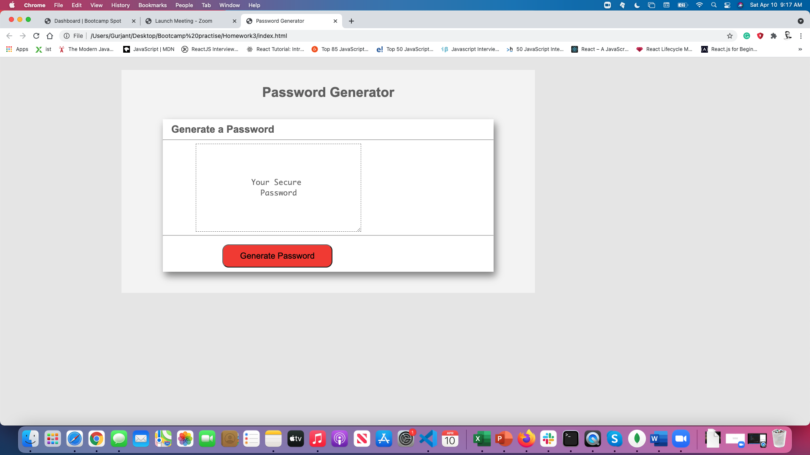
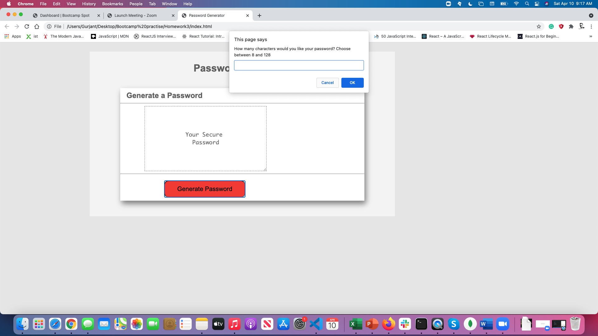
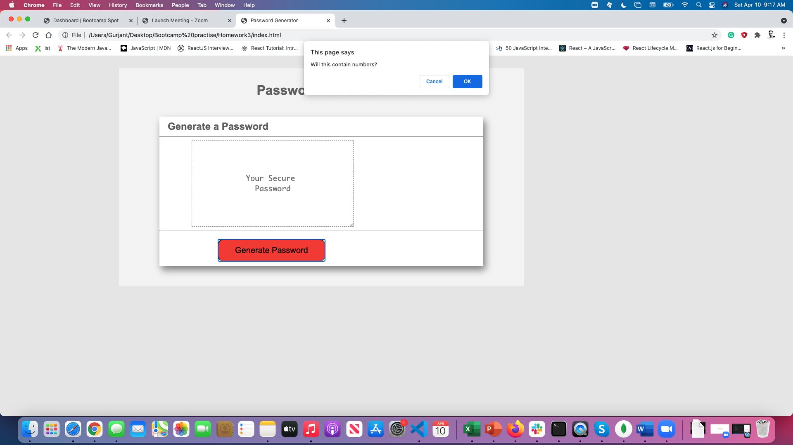
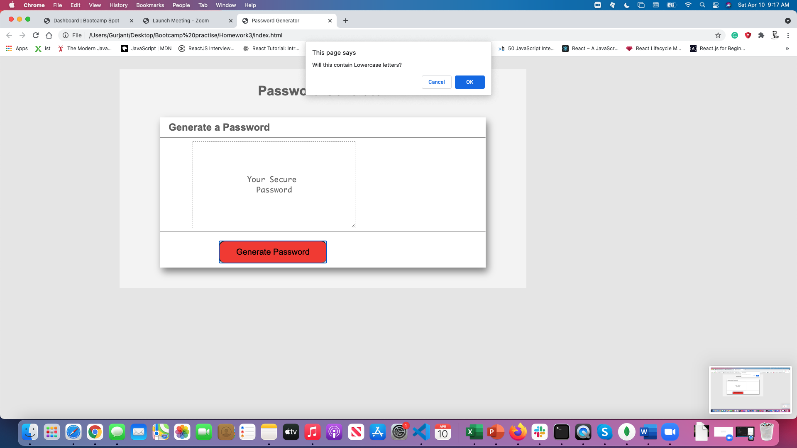

# Password Generator

This project was designed as a homework assignment for UNH's coding bootcamp.

This application emphasizes the use of Javascript to generate a random, secure password for the user.

This project has been deployed to GitHub Pages. To get this project up and running, you can follow the deployment link. Or, download the sources files to use this as a template.

# Getting Started

This project has been deployed to GitHub Pages. To get this project up and running, you can follow the deployment link. Or, download the sources files to use this as a template.

# Summary

HTML and CSS and Javascript documents create a random password generator
This project emphasizes the use of using Javascript to make dynamic changes to an HMTL document

A Textarea
This textarea will display the users password once it is generated

#

#

#

#

#

#

## Contributors

[Gurjant Riar](https://github.com/gurjantriar/)

#

## Built With:

[Visual Studio](https://visualstudio.microsoft.com/)

[CSS](https://www.w3.org/TR/CSS/#css)

[Github Profile](https://github.com/GurjantRiar/passwordgenerator)
